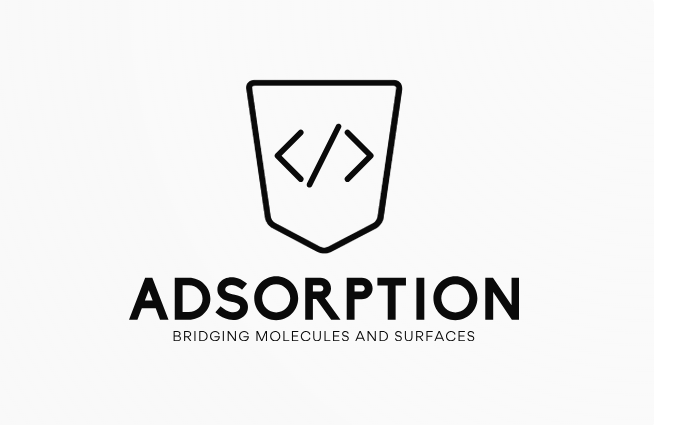

# Adsorption of Complex Molecules on Surfaces

## Overview
This Python script facilitates the adsorption of complex molecules onto surfaces, offering the flexibility to manipulate both the adsorption position and the orientation of the molecule. It provides a convenient tool for researchers and scientists working in the field of surface science and molecular dynamics simulations.

## Features
- **Flexible Input**: Accepts input files for both the surface and the molecule, allowing users to specify the origin and head atoms for defining the direction along the molecule, the angle for rotating the molecule around the z-axis, the atom of the slab on which to adsorb the molecule, and the desired adsorption height.
- **Atomic Simulation Environment (ASE) Integration**: Utilizes the ASE library for reading and writing structure files, ensuring compatibility with various file formats such as POSCAR, xyz, and cif.
- **Customization**: Allows users to customize adsorption positions, orientations, and heights to suit their specific research needs.
- **Efficient Processing**: Employs efficient algorithms for calculating molecule orientation, rotating the molecule, and translating it to the adsorption site on the surface.
- **Output Generation**: Generates an output file containing the combined structure of the surface and the adsorbed molecule in the VASP POSCAR format for further analysis and visualization.

## Usage
1. **Clone the Repository**: Clone this repository to your local machine.
2. **Install Dependencies**: Ensure you have Python installed, along with the Atomic Simulation Environment (ASE) library.
3. **Run the Script**: Execute the `Adsorption.py` script and follow the prompts to specify input files and parameters.
4. **View Results**: Check the generated output file (`POSCAR.vasp`) for the combined structure of the surface and the adsorbed molecule.
5. **graphycal user interface (GUI)**: tkinter python package is required for runing the GUI version of the code.

## Example
ppython3 Adsorption.py surface_file.vasp molecule_file.xyz --origine 0 --vertex 1 --adsorb_index 2 --height 3.5 --theta_z 30

This example demonstrates how to use the script to perform adsorption of a molecule on a surface. The user is prompted to input the filenames of the surface and molecule files, as well as the indices of the atoms defining the direction of the molecule. Then, the user specifies the index of the atom on the surface for adsorption, the desired adsorption height, and the angle of rotation arround z axis.

## License
This project is licensed under the GNU General Public License (GPL) version 3 - see the [LICENSE](LICENSE) file for details.

## Contributions
Contributions are welcome! Feel free to submit issues or pull requests.

## Disclaimer
This software is provided as-is, without warranty of any kind, express or implied, including but not limited to the warranties of merchantability, fitness for a particular purpose, and non-infringement. In no event shall the authors or copyright holders be liable for any claim, damages, or other liability, whether in an action of contract, tort, or otherwise, arising from, out of, or in connection with the software or the use or other dealings in the software.

## Contact
For any questions or inquiries, please contact Kazem Zhour(mailto:kazem.zhour@gmail.com).

